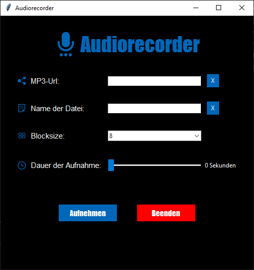

# AudiorecorderUI Program
The "AudiorecorderUI" is a recording program designed with Tkinter. It allows users to record an MP3 stream for up to 200 seconds.

## Program Features
- Record an MP3 stream for up to 200 seconds
- Provides information during recording
- Accepts input for MP3 URL, dataname, block size, and duration
- Validates input for a syntactically correct URL and dataname
- Clear content of input fields (URL and dataname) with a reset button

## UI Design
